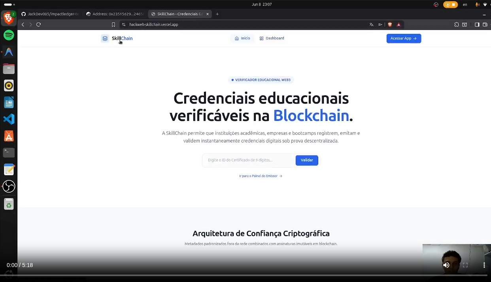

# 🎓 SkillChain - Verifiable Educational Credentials

[](https://hackweb-skillchain.vercel.app/)
[](https://sepolia.etherscan.io/address/0x2351562952afb48bf847C96065531e724658Da2F)
[](https://opensource.org/licenses/MIT)

**SkillChain** é uma plataforma Web3 descentralizada projetada para emissão, armazenamento e verificação pública de certificados educacionais e diplomas acadêmicos. 

Utilizando a rede de testes **Ethereum Sepolia**, a plataforma atesta a autenticidade e integridade dos documentos escolares de forma imutável e transparente, combatendo fraudes de currículo e simplificando o processo de validação por recrutadores e departamentos de Recursos Humanos.

---

## 💡 O Propósito: Por que SkillChain?

1. **Combate a Fraudes Acadêmicas:** De acordo com pesquisas de mercado, uma porcentagem significativa de currículos contém diplomas falsos ou cargas horárias infladas. O SkillChain impede isso registrando a impressão digital única (hash criptográfico) do certificado diretamente na blockchain.
2. **Eliminação de Burocracia:** Processos tradicionais de validação de diplomas exigem contato direto com cartórios ou com as secretarias das universidades. Com a SkillChain, a verificação é instantânea, pública e criptograficamente auditável por qualquer pessoa.
3. **Soberania do Estudante:** O estudante passa a ter um portfólio digital seguro contendo todas as suas certificações verificadas de diferentes instituições em um só lugar.

---

## 🛠️ Funcionalidades Principais

* **Portal Multiusuário (Roles):**
  * **Admin Máximo (Autoridade Governamental/MEC):** Responsável por aprovar ou rejeitar instituições de ensino na rede para garantir que apenas entidades legítimas emitam diplomas.
  * **Instituições de Ensino (Universidades/Escolas):** Cadastram cursos, gerenciam cargas horárias e emitem certificados vinculados às carteiras dos alunos.
  * **Estudantes:** Acessam seus painéis e visualizam seus certificados acumulados de forma organizada.
* **Integração Web3 e MetaMask Consolidada:**
  * **HUD de Carteira Completo:** Painel de status no cabeçalho do Dashboard exibindo conexão de carteira e endereço ativo.
  * **Alternância de Contas em Tempo Real:** Escuta ativa do evento `accountsChanged` do MetaMask para sincronizar instantaneamente a carteira ativa na extensão com a sessão do site.
  * **Seletor de Carteira Inteligente:** O clique em Conectar força a exibição do diálogo de seleção de conta do MetaMask (`wallet_requestPermissions`) para facilitar testes multi-carteira.
  * **Recuperação de Sessão Resiliente:** Auto-reconexão silenciosa caso o contrato precise ser chamado após um refresh de página.
* **Integridade Transacional Rígida:**
  * **Rollback de Banco de Dados:** Sem simulações locais ou mocks. Se a transação falhar ou for rejeitada na blockchain, o backend não registra a ação no banco de dados e retorna erro apropriado.
* **Validação Pública Instantânea:**
  * Qualquer recrutador ou empresa pode acessar a página de verificação sem login.
  * O sistema consulta o contrato inteligente on-chain e atesta se o emissor era autorizado e se o hash confere com o registrado em blockchain.

---

## ⚙️ Arquitetura Tecnológica

O projeto é estruturado em um monorepo dividido em duas partes principais:

* **Frontend (React + Vite):**
  * **Estilização:** Tailwind CSS v4 para uma interface moderna, minimalista e responsiva em tons de azul escuro e cinza.
  * **Animações:** Framer Motion para transições de página e feedbacks de carregamento fluidos.
  * **Web3 Integration:** Ethers.js v6 para comunicação direta com a MetaMask e leitura de contratos na rede Sepolia.
* **Backend (Node.js + Express + Supabase):**
  * Persistência de dados completa integrada ao PostgreSQL do Supabase para cursos, instituições e certificados emitidos.
  * Conexão blockchain integrada para validar o status real on-chain das credenciais.
* **Contratos Inteligentes (Solidity + Hardhat):**
  * Contrato `SkillChain.sol` contendo a governança de aprovação de instituições e a emissão e revogação de certificados.
  * Compilado e testado usando a suíte Hardhat.

---

## 🚀 Como Executar o Projeto Localmente

### Pré-requisitos
* Node.js (v18 ou superior)
* Extensão da carteira MetaMask instalada no navegador

### 1. Configurando o Backend
Navegue até a pasta do backend, instale as dependências:

```bash
cd backend
npm install
```

Crie um arquivo `.env` na pasta `backend/` seguindo as credenciais configuradas:
```env
PORT=5000
JWT_SECRET=sua_chave_secreta_jwt
ALCHEMY_API_KEY=sua_api_key_do_alchemy
SEPOLIA_PRIVATE_KEY=sua_chave_privada_da_carteira
NEXT_PUBLIC_SUPABASE_URL=sua_url_supabase
NEXT_PUBLIC_SUPABASE_ANON_KEY=sua_anon_key_supabase
```

Inicie o servidor de desenvolvimento do backend:
```bash
npm run dev
```
O servidor estará rodando em `http://localhost:5000`.

### 2. Configurando o Frontend
Abra um novo terminal na raiz do projeto, navegue até a pasta do frontend e instale as dependências:

```bash
cd frontend
npm install
```

Inicie o servidor de desenvolvimento do frontend:
```bash
npm run dev
```
O frontend estará acessível em `http://localhost:5173`.

---

## ⛓️ Informações de Deploy (Produção)

### Smart Contract (Sepolia Testnet)
O contrato inteligente está implantado sob o endereço:
* **Contrato:** `0x2351562952afb48bf847C96065531e724658Da2F`
* **Explorador:** [Sepolia Etherscan](https://sepolia.etherscan.io/address/0x2351562952afb48bf847C96065531e724658Da2F)

### Hospedagem (Vercel)
O projeto está publicado em produção:
* **URL:** [https://hackweb-skillchain.vercel.app/](https://hackweb-skillchain.vercel.app/)

---

## 🎥 Demonstração Visual e Recursos

Para visualizar a aplicação em ação e compreender a arquitetura e fluxos de negócio, disponibilizamos os seguintes materiais no diretório [`/assets`](./assets):

### 📢 Pitch de Apresentação
* **Vídeo do Pitch:** [Assista ao vídeo do Pitch de Apresentação (pitch.mp4)](./assets/pitch.mp4)
* **Miniatura do Pitch:** 
  

### ⚙️ Demonstração e Fluxo da Aplicação
* **Vídeo de Demonstração (Demo):** [Assista ao vídeo de fluxo de uso da aplicação (fluxo_da_aplicacao.mp4)](./assets/fluxo_da_aplicacao.mp4)
* **Diagrama de Fluxo:**
  

---

## 🔑 Dados para Apresentação (Demo)

Para testar a aplicação sem precisar criar dados do zero, utilize as credenciais descritas abaixo:

### 1. Contas de Login (E-mail e Senha)

* 🔴 **Administrador Master** (Aprova instituições e gerencia o sistema)
  * **E-mail:** `admin@skillchain.org`
  * **Senha:** `adminpassword`
  * **Role:** `Admin`
  * **Carteira:** `0x3302beC705ef21e65566e2E841D7A0204fF1820b` (Admin Máximo no Smart Contract com assinaturas liberadas, sem necessidade de conectar carteira via MetaMask para ações administrativas)

* 🏢 **Instituição de Ensino** (Cadastra cursos e emite certificados)
  * **E-mail:** `uniateneu@uniateneu.org`
  * **Senha:** `123`
  * **Role:** `Institution` (Já aprovada pelo admin)
  * **Carteira Associada:** `0xB3f6C35D82fD4F130282126B04efc10f94f4BCAe`

---

### 2. Certificados em Blockchain de Teste (Para validação pública)

Você pode digitar qualquer um dos IDs abaixo na barra de busca pública de verificação para visualizar o status do certificado:

* **Certificado Válido / Ativo:**
  * **ID de Validação:** `162051003`
  * **Hash da Transação (Blockchain):** `0xee3406bcfb859338e4ffdca4773a458f3ee0890a682fe2ba8d6b6b87849bef63`
  * **Hash IPFS:** `QmZ23xG5bMs5EumBWNNtbmFn2zVUxcy5BrkqXyLHJ5NcBd`
  * **Nome do Aluno:** `jackson lorran`
  * **Instituição Emissora:** `uniateneu`
  * **Status:** `ATIVO / VÁLIDO`

* **Certificado Revogado / Suspenso:**
  * **ID de Validação:** `961939237`
  * **Hash da Transação (Blockchain):** `0x82455a9b867a994bd6bf2e5553493b62184d4d92bee4c26e400d156187a19603`
  * **Hash IPFS:** `QmRb976KxR853n6Rm8F2qZKKQPqcbbmGRRoEhepDzL8ZTj`
  * **Nome do Aluno:** `joao batista`
  * **Instituição Emissora:** `unifametro`
  * **Status:** `REVOGADO / SUSPENSO`

---

## 👥 Equipe

* **Jackson Lorran do Nascimento** - (jackson.nasc20@gmail.com)